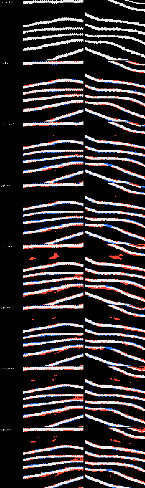
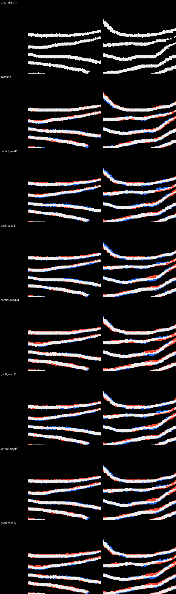
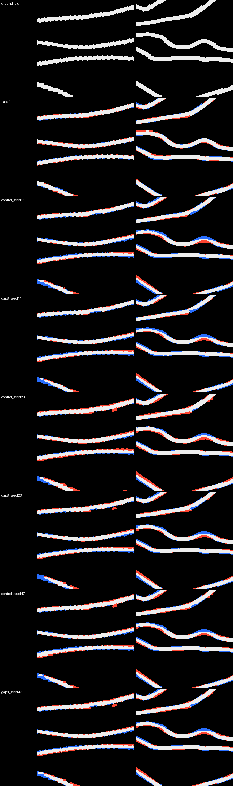
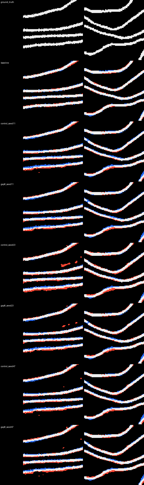

# Fusion-aware surface training: sealed held-out evidence

This report is generated mechanically from the sealed result artifacts after independent recomputation. It reports every preregistered gate and the complete fixed-threshold sensitivity summaries; values are rounded to six decimals only for display.

The intervention is the preregistered gap8 supervision term. The matched control and gap8 arms share architecture, data, initialization seeds, optimizer schedule, and evaluation protocol. These tests evaluate surface topology and segmentation; they do not by themselves establish recovered text or a complete-scroll reading.

The synthetic primary-gate pooling implementation was clarified before held-out inference, without viewing any held-out endpoint. The immutable clarification first appeared at commit `1e0ced2c928fa0842aa8c601f39dbcd49272247e` with file SHA-256 `c849d7a268465dd17b8c5d0c6774e7caab5caa343eb2dacb0cf4d862db3166dd`. The original stricter per-seed numeric checks are reported below as secondary diagnostics.

## Artifact identities

| artifact | bytes | SHA-256 | embedded payload SHA-256 |
|---|---:|---|---|
| frozen_thresholds.json | 345175 | `a76b5db4316bb1eea1f28196d798cd6ccb83a78b4c6982f5c1f1f940c8da678b` | `ebede0c11902f5a9200689a65d9c7b8a0c58f2845d63d52d22c4bd827d295b3a` |
| real_split_manifest.json | 66251 | `dedc881134d9de2ed2605162f82dfb219b52c6e05629c68223100b148b15d4fe` | `n/a` |
| heldout_execution_plan.json | 61799 | `cd02eec3812b5b04dd3902681aad875d78dc43a3c567f28f3b5ce05e184ff4a6` | `040c34e18f26e2b76cea937617c5375ef2222fc07b226a38451b275cb624820e` |
| heldout_cache_delivery_manifest.json | 24313 | `6d4b730087dd61897db40741761e97fa329b2c19f7e520495bf964341b0935bc` | `85cf0c992bdff646d376f3c8cf8d114d374c537263a9443fe6c2e320cbea63af` |
| scoring_run_manifest.json | 13007 | `4d8168d2ca03e6bb77e59a7ce2685a53b1f3b6d26d6057b9d523ddec3c14da14` | `795b0d85defe8cabc94f59da94fdc9276d2375108830bd706f2657e3ad888728` |
| scoring_run_manifest.json | 6715 | `66e4f380a75b4d132820d6860caf58fe69f009df9374c24587ae94347bf86aed` | `2d24669bdb73e7179b8c9b348ba10a90b99203d9bd9a58c2cf935af9f7ebace0` |
| mixed_scoring_result_sources.json | 7728 | `9bcb36ddf219cabc631cd8ef286e33eae94c1b7796d20ded78271c4b4a2dd357` | `45d824725cf0cf4b0062cec8ae9760d7382aeb394ba296f14e1070ee9b436fec` |
| generated_scoring_packages_index.json | 4502 | `ca38b660f898b7c21c14afca39e0800431e1c29615401b659a37e1b99a2e4c1b` | `5f335db484103c85aefb1e6ce74e61c1857d715f1282213609ee3bc9f32ff193` |
| fusion-aware-scoring-pair-v4.json | 2940 | `a432b8a49f9a43af3f0b06a5b849bd8123d8aca311775aa100f5d50bb8283e6e` | `bf581c3e9971098254070037a13a34b274b9fa42f122de78abc66edf66ef72c1` |
| real_panel_manifest.json | 25072 | `e1799845c7b8bd428e6bd374f745d6b42399673a5b8c2c11d9282324b3e72779` | `65dbd84d13aac0fe2e27baf877e5b836d58f2202f9c5e9bcf84bb41694500844` |
| real_panel_render_manifest.json | 11139 | `10a43962245973832b297ccd7deefa9b787d484d03f6ed81c8ccdbc0ad75150a` | `bfa6781f2b0e19be217e4f12e8257ef012a64dcd6e08bdf8a1f1b3784f20bdb1` |
| visual_observations.json | 3863 | `f7fb1355b1a1047054fe3aca7ebba067de122e548a88acdad0de46d2d60f6e20` | `n/a` |
| visual_assessment.json | 5900 | `b457d90d38eaf965b063ddeeecc66622d368915f05550afa974ddc8ed5993d1e` | `330d9cd52e6a10fa8f04a68ff0f2ea6723cb87dc0a61df362f9dba77f7c68c4d` |
| sealed_real_test_results.json | 238198 | `e07ce95e6420fbfd3e01602cb0f74cb33752739529262d245e3aa87561fd9976` | `01965ef5778898fc5bb60f476f5920e6d088e9493672663203d296e4f09ffd86` |
| sealed_synthetic_test_results.json | 1087485 | `bb7a512dcb457e6bba68be43e7e46fe05ca15a5c060106e4e49b0591d2c67820` | `4cbc658faad8672275c5773273be2275c79a580ae0ec000979bb5e2946426796` |
| real_panel_01.png | 39460 | `c97e0ea49da2396344dd18375138162151ac94285a83031e53cb8b3b1b8a9c58` | n/a |
| real_panel_02.png | 31082 | `94a34fe587ebfb0e4955cde32593fb29accc00eca851dca3be987b0d79fe3769` | n/a |
| real_panel_03.png | 31655 | `def8bda21c78b777bdaed2cb748bfc00c5b0bf79a66f5b1f2d359add800663de` | n/a |
| real_panel_04.png | 35665 | `38338db01e8562efd52aba6684b794331e02f113dad227b89c04faaf859b7b70` | n/a |

## Preregistered gate readout

| domain | gate | criterion | result |
|---|---|---|:---:|
| real Scroll-4/5 | blend non-inferiority | pooled mean gap8-control >= -0.005 | PASS |
| real Scroll-4/5 | TopoScore improvement | pooled mean gap8-control > 0 | PASS |
| sealed synthetic | pooled fusion reduction | pooled raw-count delta <= -0.10 | PASS |
| sealed synthetic | seed consistency | fusion delta < 0 in all three matched seeds | PASS |
| sealed synthetic | pooled detection preservation | pooled raw-count delta >= -0.02 | FAIL |
| sealed synthetic | pooled false-split control | pooled raw-count delta <= +0.02 | FAIL |
| fixed real panels | visual separation | at least one gap8/matched-control comparison improves separation without a new nearby break | PASS |

A failed gate remains evidence and is not removed or relabeled. Descriptive intervals are not substituted for the preregistered Boolean criteria.

## Real Scroll-4/5 selected-threshold results

| run | threshold | blend | TopoScore | surface Dice | VOI score |
|---|---:|---:|---:|---:|---:|
| baseline | 0.450000 | 0.686876 | 0.418124 | 0.959608 | 0.644503 |
| control_seed11 | 0.600000 | 0.578983 | 0.115515 | 0.960268 | 0.594956 |
| control_seed23 | 0.450000 | 0.561239 | 0.076799 | 0.945613 | 0.592100 |
| control_seed47 | 0.550000 | 0.567594 | 0.089745 | 0.955815 | 0.588959 |
| gap8_seed11 | 0.600000 | 0.586225 | 0.135600 | 0.961067 | 0.597632 |
| gap8_seed23 | 0.600000 | 0.565667 | 0.076036 | 0.956949 | 0.594070 |
| gap8_seed47 | 0.500000 | 0.566001 | 0.085208 | 0.952968 | 0.591141 |

## Real matched-seed deltas

| comparison | metric | mean gap8-control | 95% descriptive interval | patches |
|---|---|---:|---:|---:|
| seed 11 | blend | 0.007242 | [0.003693, 0.010704] | 38 |
| seed 11 | toposcore | 0.020085 | [0.008176, 0.031670] | 38 |
| seed 11 | surface_dice | 0.000799 | [0.000554, 0.001051] | 38 |
| seed 11 | voi_score | 0.002677 | [0.001265, 0.004489] | 38 |
| seed 23 | blend | 0.004428 | [0.000622, 0.008313] | 38 |
| seed 23 | toposcore | -0.000763 | [-0.011384, 0.009994] | 38 |
| seed 23 | surface_dice | 0.011336 | [0.008450, 0.014832] | 38 |
| seed 23 | voi_score | 0.001970 | [-0.001654, 0.006226] | 38 |
| seed 47 | blend | -0.001594 | [-0.004679, 0.001569] | 38 |
| seed 47 | toposcore | -0.004537 | [-0.014449, 0.005390] | 38 |
| seed 47 | surface_dice | -0.002847 | [-0.004302, -0.001691] | 38 |
| seed 47 | voi_score | 0.002183 | [-0.000133, 0.003981] | 38 |
| pooled seed mean | blend | 0.003359 | [0.001333, 0.005520] | 38 |
| pooled seed mean | toposcore | 0.004928 | [-0.001584, 0.011839] | 38 |
| pooled seed mean | surface_dice | 0.003096 | [0.002415, 0.003854] | 38 |
| pooled seed mean | voi_score | 0.002277 | [0.001024, 0.003707] | 38 |

## Real fixed sensitivity readout

| run | threshold | selected | blend | TopoScore | surface Dice | VOI score |
|---|---:|:---:|---:|---:|---:|---:|
| baseline | 0.400000 | no | 0.684888 | 0.414446 | 0.958687 | 0.642896 |
| baseline | 0.450000 | yes | 0.686876 | 0.418124 | 0.959608 | 0.644503 |
| baseline | 0.500000 | no | 0.660862 | 0.342696 | 0.960264 | 0.634174 |
| baseline | 0.600000 | no | 0.656522 | 0.342193 | 0.961158 | 0.621311 |
| control_seed11 | 0.400000 | no | 0.569367 | 0.098399 | 0.947576 | 0.594846 |
| control_seed11 | 0.500000 | no | 0.576794 | 0.110940 | 0.956121 | 0.596770 |
| control_seed11 | 0.600000 | yes | 0.578983 | 0.115515 | 0.960268 | 0.594956 |
| control_seed23 | 0.400000 | no | 0.555860 | 0.070158 | 0.938782 | 0.589253 |
| control_seed23 | 0.450000 | yes | 0.561239 | 0.076799 | 0.945613 | 0.592100 |
| control_seed23 | 0.500000 | no | 0.567599 | 0.088488 | 0.950847 | 0.595019 |
| control_seed23 | 0.600000 | no | 0.568908 | 0.086159 | 0.957514 | 0.594086 |
| control_seed47 | 0.400000 | no | 0.560037 | 0.078156 | 0.943456 | 0.589658 |
| control_seed47 | 0.500000 | no | 0.565745 | 0.085396 | 0.952999 | 0.590220 |
| control_seed47 | 0.550000 | yes | 0.567594 | 0.089745 | 0.955815 | 0.588959 |
| control_seed47 | 0.600000 | no | 0.566914 | 0.089279 | 0.957571 | 0.585658 |
| gap8_seed11 | 0.400000 | no | 0.572173 | 0.102474 | 0.949604 | 0.597342 |
| gap8_seed11 | 0.500000 | no | 0.581468 | 0.123971 | 0.957305 | 0.597773 |
| gap8_seed11 | 0.600000 | yes | 0.586225 | 0.135600 | 0.961067 | 0.597632 |
| gap8_seed23 | 0.400000 | no | 0.555334 | 0.072129 | 0.937324 | 0.587520 |
| gap8_seed23 | 0.500000 | no | 0.562195 | 0.074390 | 0.949813 | 0.592695 |
| gap8_seed23 | 0.600000 | yes | 0.565667 | 0.076036 | 0.956949 | 0.594070 |
| gap8_seed47 | 0.400000 | no | 0.559620 | 0.078469 | 0.943304 | 0.588352 |
| gap8_seed47 | 0.500000 | yes | 0.566001 | 0.085208 | 0.952968 | 0.591141 |
| gap8_seed47 | 0.600000 | no | 0.570289 | 0.094560 | 0.957827 | 0.590519 |

## Sealed synthetic selected-threshold results

| run | threshold | primary detection | primary conditional fusion | control false split |
|---|---:|---:|---:|---:|
| baseline | 0.450000 | 0.251618 | 0.729242 | 0.934511 |
| control_seed11 | 0.600000 | 0.825397 | 0.584090 | 0.709031 |
| control_seed23 | 0.450000 | 0.871540 | 0.640347 | 0.473241 |
| control_seed47 | 0.550000 | 0.833786 | 0.594244 | 0.672461 |
| gap8_seed11 | 0.600000 | 0.775410 | 0.490468 | 0.784671 |
| gap8_seed23 | 0.600000 | 0.704204 | 0.481530 | 0.826255 |
| gap8_seed47 | 0.500000 | 0.816954 | 0.525357 | 0.644327 |

## Sealed synthetic pooled primary readout

| arm | neighbour sites | detected neighbour sites | fused detected sites | control sites | false-split sites | detection rate | conditional fusion | false-split rate |
|---|---:|---:|---:|---:|---:|---:|---:|---:|
| control | 4795200 | 4045107 | 2454609 | 619200 | 382817 | 0.843574 | 0.606809 | 0.618245 |
| gap8 | 4795200 | 3670834 | 1835926 | 619200 | 465484 | 0.765523 | 0.500139 | 0.751751 |
| gap8-control | — | — | — | — | — | -0.078052 | -0.106671 | 0.133506 |

## Sealed synthetic matched-seed deltas and stricter secondary diagnostics

| seed | fusion delta | detection delta | false-split delta | >=10 pp secondary | detection secondary | false-split secondary |
|---:|---:|---:|---:|:---:|:---:|:---:|
| 11 | -0.093621 | -0.049987 | 0.075640 | FAIL | FAIL | FAIL |
| 23 | -0.158817 | -0.167336 | 0.353014 | PASS | FAIL | FAIL |
| 47 | -0.068887 | -0.016832 | -0.028135 | FAIL | PASS | PASS |

## Sealed synthetic fixed sensitivity readout

| run | threshold | selected | primary detection | primary conditional fusion | control false split |
|---|---:|:---:|---:|---:|---:|
| baseline | 0.400000 | no | 0.275405 | 0.747864 | 0.917175 |
| baseline | 0.450000 | yes | 0.251618 | 0.729242 | 0.934511 |
| baseline | 0.500000 | no | 0.229717 | 0.709134 | 0.948658 |
| baseline | 0.600000 | no | 0.187754 | 0.667881 | 0.971032 |
| control_seed11 | 0.400000 | no | 0.922715 | 0.683417 | 0.359690 |
| control_seed11 | 0.500000 | no | 0.882386 | 0.633497 | 0.513382 |
| control_seed11 | 0.600000 | yes | 0.825397 | 0.584090 | 0.709031 |
| control_seed23 | 0.400000 | no | 0.892989 | 0.662494 | 0.399496 |
| control_seed23 | 0.450000 | yes | 0.871540 | 0.640347 | 0.473241 |
| control_seed23 | 0.500000 | no | 0.846425 | 0.618328 | 0.557965 |
| control_seed23 | 0.600000 | no | 0.780410 | 0.572067 | 0.739516 |
| control_seed47 | 0.400000 | no | 0.907671 | 0.658489 | 0.420402 |
| control_seed47 | 0.500000 | no | 0.862626 | 0.615309 | 0.576739 |
| control_seed47 | 0.550000 | yes | 0.833786 | 0.594244 | 0.672461 |
| control_seed47 | 0.600000 | no | 0.799030 | 0.572634 | 0.754094 |
| gap8_seed11 | 0.400000 | no | 0.895015 | 0.581045 | 0.387892 |
| gap8_seed11 | 0.500000 | no | 0.843852 | 0.537458 | 0.574549 |
| gap8_seed11 | 0.600000 | yes | 0.775410 | 0.490468 | 0.784671 |
| gap8_seed23 | 0.400000 | no | 0.847575 | 0.560870 | 0.442292 |
| gap8_seed23 | 0.500000 | no | 0.786028 | 0.522053 | 0.637965 |
| gap8_seed23 | 0.600000 | yes | 0.704204 | 0.481530 | 0.826255 |
| gap8_seed47 | 0.400000 | no | 0.871221 | 0.562667 | 0.456681 |
| gap8_seed47 | 0.500000 | yes | 0.816954 | 0.525357 | 0.644327 |
| gap8_seed47 | 0.600000 | no | 0.744038 | 0.486206 | 0.831153 |

## Scope and limitations

- Scroll-4/5 results are held-out real-data segmentation metrics at thresholds selected once on Scroll-1 validation.
- Synthetic ray results isolate a known fusion geometry and test the directional mechanism; they are not a direct estimate of real-scroll fusion prevalence.
- The four preregistered real panels are a separate fixed-location qualitative check and must be published with their hashes; this report does not convert visual judgment into an automatic pass.
- The submission must retain null, mixed, or adverse results and must not claim text recovery unless a separate text-reading evaluation supports it.

## Four preregistered fixed real panels

These panels are rendered mechanically from the four model-blind coordinates. All four are shown; no panel is selected or omitted after inference.

## Complete fixed-panel visual assessment

Assessor: OpenAI Codex independent visual review. Method: complete side-by-side review of every fixed panel and every matched gap8-versus-control seed pair; only a clearly visible separation improvement counted.

| panel | seed | separation improvement | new nearby break | comparison pass | notes |
|---:|---:|:---:|:---:|:---:|---|
| 1 | 11 | no | no | FAIL | Panel 1 seed 11: gap8 and control preserve the same visible layer separations; no clear additional separation improvement is verifiable. |
| 1 | 23 | yes | no | PASS | Panel 1 seed 23: gap8 removes the large isolated foreground bridges/blobs visible between neighboring layers in the matched control while preserving the nearby continuous layers. |
| 1 | 47 | no | no | FAIL | Panel 1 seed 47: the matched pair remains visually similar around the compressed layers and does not show a clear separation gain. |
| 2 | 11 | no | no | FAIL | Panel 2 seed 11: both rows keep the same principal gaps; the small boundary changes do not establish a clear separation improvement. |
| 2 | 23 | no | no | FAIL | Panel 2 seed 23: differences are limited to boundary-width details, with no visually decisive new separation between adjacent sheets. |
| 2 | 47 | no | no | FAIL | Panel 2 seed 47: control and gap8 show substantially the same connected sheet layout and gaps, so no clear improvement is recorded. |
| 3 | 11 | no | no | FAIL | Panel 3 seed 11: the matched predictions have the same visible separations and terminations; no additional gap8 separation is evident. |
| 3 | 23 | no | no | FAIL | Panel 3 seed 23: both rows trace the same nearby sheets with only small edge differences and no decisive separation change. |
| 3 | 47 | no | no | FAIL | Panel 3 seed 47: the control and gap8 rows are visually equivalent for the preregistered separation criterion. |
| 4 | 11 | no | no | FAIL | Panel 4 seed 11: the same sheets and gaps remain visible in both rows; no clear gap8 separation benefit is present. |
| 4 | 23 | no | no | FAIL | Panel 4 seed 23: isolated foreground differences are smaller in places but do not amount to a clearly verifiable sheet-separation improvement. |
| 4 | 47 | no | no | FAIL | Panel 4 seed 47: minor foreground speckles differ, but the matched pair shows no clear improvement in separation of neighboring sheets. |

## Mixed execution provenance

The real result was scored once on the completed CPU-only RunPod path; the synthetic result is the unchanged completed Kaggle version 4. Both sources were hash-verified and jointly collected before either scientific result or panel was opened. The full result-blind operational history is published in `OPERATIONAL_ATTEMPT_AUDIT.md`.
